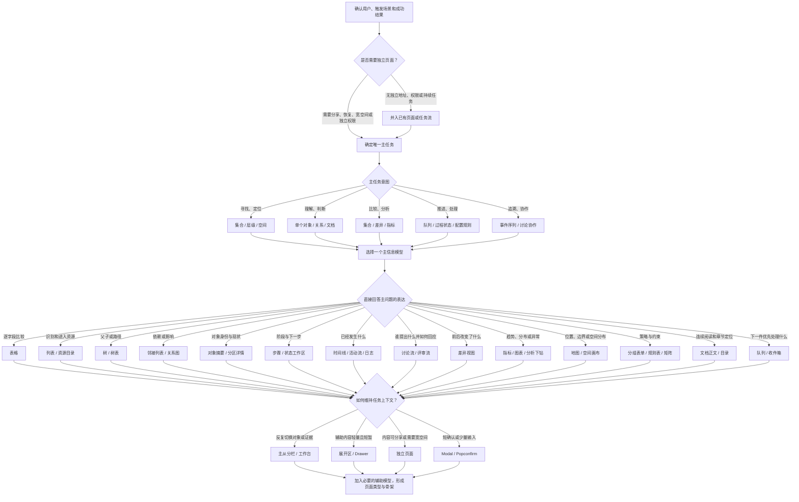
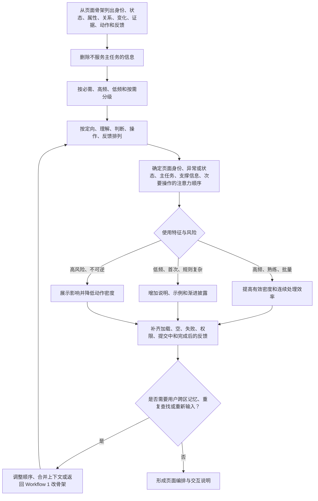
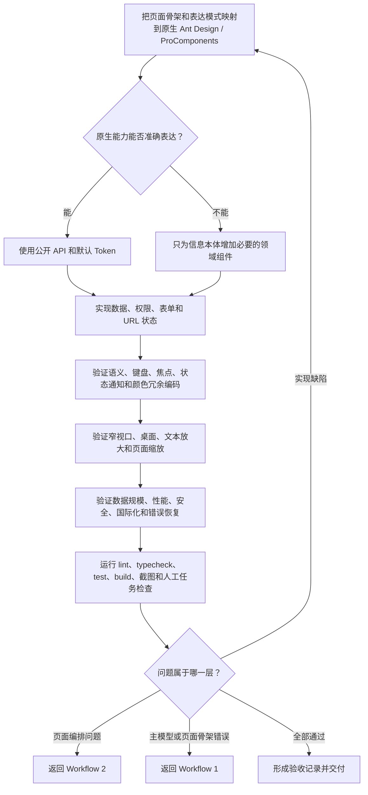

# 企业系统页面组织指南（Ant Design）

> 面向产品、设计师、前端开发者和 AI 编码工具：识别业务信息的核心模型，使用合适的表达模式和原生 Ant Design Pro / ProComponents 组织页面，让用户能够连续地理解、判断和操作。
>
> 本手册约束的是信息表达、信息组织、页面编排和任务动线，不是一套视觉风格规范，也不是原子组件使用手册。`antd`（Ant Design）与 `@ant-design/pro-components` 的默认样式和组件行为是基线；无明确品牌、可访问性或业务表达需求时，不修改主题、不覆盖组件样式。已有项目的组件版本、业务术语和相邻页面优先于本文示例。
>
> **版本：2026.09.04**（初始版本）。变更记录见 [CHANGELOG](./CHANGELOG.md)。本仓库为唯一事实源；如在其他仓库引用本规范，只允许读取，禁止就地修改，修改须回本仓库进行。

---

## 一、如何使用本指南

### 1.1 执行约束

本指南只解决信息模型、页面骨架、信息分布和任务动线。实现时遵守以下最小约束：

- 先确认用户、主任务、主信息模型和成功结果，再选择页面类型和组件。
- 事实源优先级为：产品规则与权限模型 → 当前项目实现与依赖 → 本指南 → 官方文档 → 历史示例。
- 一个页面只有一个主模型；标题、状态、主动作和核心判断信息应在首屏形成清晰顺序。
- 不按接口字段或组件清单组织页面；不使用 Card、颜色或弹层掩盖信息层级问题。
- 完成实现后只需验证：信息分布是否成立、主任务是否可完成、窄视口和键盘操作是否破坏结构。

### 1.2 三阶段工作流

页面设计不使用一棵包办所有问题的决策树，也不把每项质量属性拆成独立流程。统一收敛为“页面定型、页面编排、实现验收”三个阶段，本文第二、三、四章分别是三个阶段按需查阅的规则库，第五章是最终检查入口。

| 阶段 | 产出 | 对应章节 |
|---|---|---|
| Workflow 1：页面定型 | 主任务、主信息模型、表达模式、页面类型和骨架 | 第二章 |
| Workflow 2：页面编排 | 内容优先级、注意力顺序、密度、任务动线和反馈方案 | 第三章 |
| Workflow 3：实现验收 | 组件映射、适配方案和验收结果 | 第四、五章 |


三个工作流遵守三条边界：

1. Workflow 1 决定页面结构；Workflow 2 不得用隐藏信息或增加容器掩盖结构错误；Workflow 3 不得用自定义样式掩盖编排错误。
2. 一个页面可以包含多个信息模型，但只能有一个模型决定首屏、主表达和主操作。
3. `Tabs`、`Card`、`Drawer` 和 `Modal` 是编排容器，不是业务信息模型，也不能代替表达模式选择。

---

## 二、Workflow 1：页面定型

本工作流只决定信息本体、页面骨架和容器关系，不处理密度、颜色、间距和加载状态。

### 2.1 设计目标

企业内部系统的价值不是“看起来像后台”，而是帮助用户在有限注意力下准确完成任务。评价一个页面时依次问：

1. 用户能否迅速确认自己在哪里、正在处理什么对象？
2. 用户能否找到完成主任务所需的信息和动作？
3. 用户能否判断当前状态、动作影响和下一步？
4. 用户出错、权限不足或系统异常时能否恢复？
5. 不同能力、设备和操作方式的用户能否完成同一核心任务？

| 原则 | 落地要求 |
|---|---|
| 任务优先 | 页面围绕用户目标组织，不照搬后端接口、数据库表或组织架构 |
| 识别优于记忆 | 展示当前上下文、已选条件、单位和状态，不要求用户跨页记 ID、规则或上次输入 |
| 渐进披露 | 默认呈现高频且影响决策的信息，低频字段、解释和高级操作在需要时展开 |
| 一致且可预期 | 同一对象、动作、状态和反馈在全站使用同一名称与行为 |
| 错误预防优先 | 用约束、默认值、预览、影响范围和权限提示减少错误，而不只依赖事后报错 |
| 用户可控 | 长操作可看到进度，重要变更可取消、撤销或明确确认，不制造无出口状态 |
| 状态连续 | 刷新、返回、重试和重新登录后，尽可能保留仍然有效的筛选、位置和草稿 |
| 可访问是底线 | 不把可访问性当作视觉完成后的补丁；语义、键盘、焦点、对比度与文案同步设计 |
| 原生优先 | 默认样式和组件行为保持 Ant Design Pro 一致，把设计精力用于信息取舍与组织 |

### 2.2 从领域模型推导表达模式

页面形式不是起点。设计前先完成四步推导：

```text
领域模型：系统里真实存在什么对象、关系、事件和规则？
    ↓
用户任务：用户要查找、理解、比较、处理、协作，还是追溯？
    ↓
信息模型：完成任务所需信息是集合、层级、关系、过程还是其他结构？
    ↓
表达模式：哪种结构能让用户用最少转换完成判断和操作？
```



禁止根据接口返回数组就选择表格，也禁止因为路由带 ID 就套用通用详情页。同一个领域对象在不同任务下可以有不同表达：Issue 在查询时是集合，在处理时是状态流程，在协作时是讨论流，在审计时是事件序列。

### 2.3 信息模型与表达骨架对照表

真正要区分的是**信息表达模式的骨架差异**，而不是业务名称。同一骨架在不同业务领域反复出现是合理的，不是页面设计的重复——不要为了“凑全”把同一种骨架在不同业务下的页面当成新类型重复沉淀。

对照成熟企业产品（GitHub、Jira/Atlassian、AWS Console、Stripe、Salesforce、Datadog、PagerDuty）常见形态，可以收敛为以下骨架，其余常见页面都是它们在具体领域的实例：

| 信息模型 | 用户需要理解什么 | 表达骨架 | 首选组件组合 | 常见领域实例 |
|---|---|---|---|---|
| 单个对象 | 身份、状态、属性、能力 | 分区详情 | `PageContainer` + `ProDescriptions` + `Tabs` | 发布单详情、应用详情 |
| 集合 | 多个同类对象的差异 | 二维比较表 | `ProTable`（查询/排序/分页/批量/无匹配清除） | 发布单、账单、报表列表 |
| 集合 | 从大量资源中发现并重新进入 | 目录与发现 | 搜索 + 分面筛选（`Select`/`TreeSelect`）+ `ProList` + 收藏/保存视图 | 组件服务目录 |
| 层级 | 父子、包含、路径 | 层级树 | `Tree` + 面包屑 + 主从 `Table` | 组织架构、资源目录树 |
| 关系网络 | 对象如何相互依赖或引用 | 关系列表 | 上游/下游邻接列表 + 影响传播提示；仅路径/传播是判断依据时才用图形 | 依赖拓扑 |
| 过程与状态 | 当前在哪一步、下一步是什么 | 分步向导 | `Steps` + 分步表单 + 高危二次确认 + `Result` | 发布审批流程、创建向导 |
| 过程与状态 | 为何停住、失败在哪一环 | 航迹下钻 | 阶段摘要 → 单步结果 → 原始日志渐进披露 | 链路追踪、审计下钻 |
| 状态连续性 | 现在是否正常、影响范围多大 | 状态墙 | 全局 `Alert` + 组件状态列表 + 事件 `Timeline` | 服务状态页 |
| 事件序列 | 先后发生了什么、由谁触发 | 事件时间线 | `Statistic` 摘要 + `Timeline` + 类型筛选 + `Collapse` 日志 | 审计日志、更新日志 |
| 讨论与协作 | 谁提出什么、回应什么、形成何种结论 | 讨论流 | `List` + `Avatar` + `Typography` + 编辑器 | 评审意见、变更讨论 |
| 文档与内容 | 连续阅读、定位章节、理解正文 | 连续文档 | `Typography` + `Anchor` 目录 + `Affix` | 知识库文档、规范手册 |
| 版本与差异 | 什么发生改变、影响在哪里 | 并置对比 | 对比范围 + `Statistic` 摘要 + 并置 `Table` 或语义化差异视图 | 配置版本对比、发布差异 |
| 空间与位置 | 对象位于哪里、边界和分布如何 | 地图 / 画布 | 原生页面外壳 + 专项可视化 | 机房拓扑、区域分布 |
| 指标与分布 | 趋势、异常、构成和相关性 | 仪表盘 / 总览 | `Statistic` + `Line`/`Column` + 待办列表 + `Alert` | 交付总览、值班首页 |
| 队列 | 下一件该处理什么、优先级如何 | 主从工作区 | 左队列（`ProList`/`ProTable`）+ 右详情 + `Drawer` | 问题工作台、审批收件箱 |
| 配置与规则 | 当前策略、适用范围、冲突和结果 | 配置表单 | `ProForm` 分组 + `Transfer`/`Slider`/`Switch` + 影响 `Alert` | 发布策略、权限授权配置 |

这些模型可以组合，但每页必须有一个主模型。辅助模型只能帮助理解或操作主模型，不能彼此争夺首屏。例如 Pull Request 可以用“变更对象”作为主模型，以讨论流、检查过程和文件差异作为平级视图；它不应被简化成一张属性详情卡。

### 2.4 表达模式的选择规则

- 需要跨对象逐列比较时用表格；只需识别和进入对象时用列表；结构顺序有意义时用树，不能一律表格化。
- 需要理解发生顺序时用时间线；需要理解当前阶段和后续步骤时用 Steps；两者不能因为外观相近而互换。
- 需要阅读和引用连续内容时保持文档结构，不把每段正文拆成 Card 或键值字段。
- 需要理解多人观点及回应关系时保持讨论上下文，不把评论降维成普通操作日志。
- 需要看“改变了什么”时直接表达前后差异，不让用户在两个详情页之间自行记忆比较。
- 需要探索关系或空间位置时，只有关系拓扑本身影响判断才使用图形；否则用分组列表表达上下游更高效。
- 原生组件能够准确表达时直接使用；没有合适原生表达时，允许实现领域专项视图。不得为了坚持“只用原生组件”而扭曲信息模型。

### 2.5 页面外壳与层级

```text
┌ 应用导航 ─────────────────────────────────────────────┐
│ 面包屑 / 页面位置                                      │
│ 页面标题 + 状态 + 简短说明                  [主操作]     │
├───────────────────────────────────────────────────────┤
│ 关键提示或待处理事项（仅在确有行动价值时出现）          │
│                                                       │
│ 查询 / 局部导航 / 工具栏                               │
│ 主内容区                                               │
│                                                       │
│ 分页 / 结果摘要                                        │
└───────────────────────────────────────────────────────┘
```

- 使用 `ProLayout` 承载应用级导航，`PageContainer` 承载页面标题、面包屑和内容边界；不要在业务页面重复造一套外壳。
- 页面主内容保持稳定左对齐。数据、表单和长文本不使用居中排版；居中只用于短空状态、结果页等明确场景。
- 标题区只放对象身份、状态、必要说明和主操作。统计卡、筛选表单、长描述不要挤进标题区。
- 相关内容靠近，无关内容用间距和分组分开。优先用留白、标题和分隔线建立层级，Card 只表达真正独立的内容容器。
- 页面级固定头部、底部操作条和悬浮控件不得遮挡内容或键盘焦点。

层级限制：

- 应用导航表达跨对象模块；页面内 Tab 表达同一对象的平级视图；局部锚点表达长页面章节。
- 同一可见区域避免同时出现三套竞争的导航（例如侧栏 + 顶部 Tab + Card 内 Tab）。
- Modal、Drawer 不是新的导航层。需要复制链接、浏览历史、复杂对比或持续工作时，应使用独立路由。
- 面包屑一般不超过 4 层；过深时优先修正信息架构，而不是截断到无法理解。

一个路由应有一个主任务和主信息模型，但可以组合多种表达模式。GitHub 的仓库、Pull Request、Actions 和 Projects 页面形态不同，原因正是它们分别围绕文档与层级、变更与讨论、过程与日志、工作流与看板组织，而不是统一套用列表—详情。

---

## 三、Workflow 2：页面编排



### 3.1 信息组成与默认位置

页面从以下信息中按任务取舍，而不是按接口字段顺序全量展示：

| 信息 | 回答的问题 | 组织要求 | 默认位置 | 不应放置的位置 |
|---|---|---|---|---|
| 身份 | 这是什么 | 名称、稳定标识和所属上下文靠近呈现 | 页面标题、对象摘要 | 深层 Tab 或表格末列 |
| 状态 | 现在怎么样 | 当前值、原因、更新时间和可达下一状态按需关联 | 标题区、摘要区、状态工作区 | 只能在详情字段中查到 |
| 属性 | 它有哪些特征 | 按用户理解分组，不按数据库或 DTO 排列 | 详情主体、分组字段、比较表 | 按接口字段顺序平铺 |
| 关系 | 它和谁有关 | 区分归属、依赖、引用、影响范围等不同语义 | 关联区、邻接列表、独立 Tab | 与属性字段混成一张大表 |
| 变化 | 与之前相比发生了什么 | 表达差异、操作者、时间和影响，而不只显示最终值 | 差异区、时间线、版本对比 | 只展示变更后的最终值 |
| 证据 | 为什么能得出这个判断 | 将日志、检查结果、来源或规则放在判断附近 | 判断结果附近、可展开日志 | 远离结论的独立日志页 |
| 动作 | 用户现在能做什么 | 动作靠近作用对象，层级反映频率、价值和风险 | 主动作在标题区或首屏；次要动作在局部工具栏 | 主动作藏进“更多”或页面底部 |
| 反馈 | 动作产生了什么结果 | 说明成功、部分成功、失败及下一步，维持任务上下文 | 动作附近、结果区 | 脱离上下文的全局提示 |

区域分配还应遵循以下规则：

- 应用级导航只表达跨对象模块；页面标题区只表达当前对象身份、状态、必要说明和主动作。
- 同一对象的平级信息使用 Tab；长内容内部章节使用锚点；不要让侧栏、顶部 Tab 和 Card 内 Tab 同时承担同一层导航。
- 判断所需的信息靠近判断结果；原始日志、完整请求和低频字段默认渐进披露，不与摘要争夺首屏空间。
- 关系、变化和证据如果会改变用户决策，应进入主内容；只是补充背景时才放入次级区域。
- 一个信息只保留一个权威展示位置。其他位置只能展示摘要、状态或入口，并明确跳转到权威位置。
- 需要分享、恢复、宽空间、独立权限或持续工作的内容使用独立路由；短确认和轻量上下文才使用 Modal / Drawer。
- 导航名称优先使用稳定的业务对象，如“发布单”“应用”“成员”，不要使用“综合管理”等空泛名称。
- 页面标题说明当前对象或任务；面包屑说明位置；Tab 说明同一对象的不同信息侧面。三者不要重复同一句话。
- 权限影响动作时，优先隐藏用户永远无权知道的能力；对用户可能获得或暂时缺少的权限，保留禁用入口并解释原因和申请路径。

### 3.2 阅读顺序与注意力

默认阅读顺序应保持为：

```text
页面身份
→ 当前状态 / 异常
→ 主任务与主动作
→ 判断所需的核心信息
→ 关系、变化与证据
→ 次要信息与低频操作
```

落到常见页面上，默认区域顺序是这一顺序的实例，不是可套用的模板：

| 常见页面 | 主要任务 | 默认区域顺序 |
|---|---|---|
| 总览页 | 发现异常、理解范围、进入任务 | 摘要 → 待处理/异常 → 趋势 → 最近活动 |
| 列表页 | 定位、比较和批量处理对象 | 标题/主操作 → 查询 → 表格/列表 → 分页 |
| 资源目录/发现页 | 查找、发现和重新进入大量资源 | 视图导航 → 搜索/分面筛选 → 资源结果 → 保存视图 |
| 详情页 | 判断单个对象并执行动作 | 身份/状态/主操作 → 核心属性 → 关系/历史 |
| 创建/编辑页 | 准确录入或修改信息 | 目标说明 → 分组表单 → 校验摘要 → 提交区 |
| 分步流程 | 完成有依赖的长任务 | 步骤与进度 → 当前步骤 → 结果确认 |
| 工作台 | 高频跨对象处理任务 | 队列/导航 → 主工作区 → 上下文详情/操作 |
| 文档页 | 连续阅读、理解与引用内容 | 标题/元信息 → 目录 → 正文 → 关联内容 |
| 活动页 | 追溯事件或协作过程 | 状态摘要 → 时间线/讨论流 → 输入与动作 |
| 对比页 | 理解版本、对象或策略之间的变化 | 对比范围 → 差异摘要 → 差异本体 → 处理动作 |
| 层级页 | 浏览和操作目录、组织或依赖结构 | 路径/范围 → 树或主从结构 → 当前节点内容 |

注意力分配规则：

- 一个页面只有一个视觉主标题（通常为 `h1`），章节标题按语义顺序递进，不按字号假装层级。
- 一个任务区域最多一个 `type="primary"` 按钮。主按钮代表当前最可能且最有价值的下一步，不代表“最危险”或“最永久”。
- 危险操作使用危险语义，但不应长期占据最高视觉权重；通常放入次要操作或更多菜单。
- 警告、错误色只用于需要用户关注的状态。正常状态不应铺满绿色，状态可用短文本、图标和低强度标签共同表达。
- Badge、Tag、Alert、Notification 都会消耗注意力。只有信息会改变用户判断或动作时才强调。

### 3.3 信息密度

信息密度不是单位面积内放了多少控件，而是用户在一个视野内能够理解和用于判断的有效信息量。压缩间距只会提高视觉密度；只有减少无关信息、建立比较关系并降低来回查找，才会提高有效信息密度。

| 密度 | 适用场景 | 设计侧重 |
|---|---|---|
| 舒展 | 首次使用、低频配置、高风险确认 | 更多说明、更大分组间距、清晰影响预览 |
| 标准 | 大多数列表、详情和表单 | 可扫描性与单位屏信息量平衡 |
| 紧凑 | 监控、运营、审计等高频专家工作台 | 稳定列宽、短文案、键盘效率、可保存视图 |

- 密度不是把字体和点击区域一起缩小。可以收紧容器留白和行距，但正文可读性、焦点和命中区域仍须达标。
- 同一页面最多使用两个相邻密度级别，例如标准页面中的紧凑表格；不要让每个区域各用一套尺度。
- 对专家用户优先提供列管理、保存视图、批量操作和快捷键，而不是无差别展示更多内容。

页面不同区域应承担不同密度：

| 区域 | 推荐密度 | 原因 |
|---|---|---|
| 应用导航 | 低 | 帮助定向，不能和业务内容争夺注意力 |
| 页面标题与对象摘要 | 低～中 | 快速确认对象、范围、状态和主动作 |
| 查询与视图控制 | 中 | 用较少空间表达当前观察范围 |
| 核心比较/工作区域 | 中～高 | 承载扫描、对比、编辑或连续处理 |
| 证据与上下文 | 中 | 在需要判断时提供，不应淹没主工作区 |
| 最终动作与反馈 | 低 | 保持位置稳定，避免误操作和遗漏结果 |

### 3.4 用默认视觉语言承载层级

- 默认使用 Ant Design 的字体、字号、行高、圆角、阴影、颜色和间距，不为单个页面建立第二套视觉系统。
- 正文行长宜控制在约 45～80 个字符；说明文字过长时限制内容宽度，不让其横跨整个大屏。
- 表格数字按位数对齐并显示单位；名称和自然语言左对齐；操作通常右对齐。相同含义保持相同格式。
- 次要信息可以降低视觉权重，但仍须满足对比度；不要用过浅灰色代替信息层级设计。
- 优先通过标题层级、内容顺序、分组、组件语义和渐进披露解决层级问题，不用自定义颜色与 CSS 补救。
- 只有全产品品牌要求、明确业务语义或默认样式不满足可访问性时才调整 Token，并在应用级统一处理。

### 3.5 导航、查询与状态保持

导航：

- 菜单按用户心智中的业务对象和工作流组织，不按微服务、前端包或团队归属组织。
- 同一层菜单尽量使用同一抽象级别和词性；名称短而具体，避免“管理”“中心”“平台”重复堆叠。
- 当前菜单、父级位置和页面标题必须一致；刷新和深链接进入时仍能正确高亮。
- 频繁切换的工作上下文（组织、空间、项目、环境）应有明确选择器，并持续显示当前值。
- 切换上下文会丢失未保存内容或改变数据范围时，必须提前提示。

搜索与筛选：

- 单一模糊关键词用搜索框；多个结构化条件用查询表单；不要把结构化筛选伪装成一个万能搜索框。
- 高频筛选默认展开，低频筛选折叠到“更多筛选”；当前生效条件即使折叠也必须可见、可单独清除。
- “查询”执行条件，“重置”恢复产品默认条件；两者不能依赖用户猜测。
- 查询后展示结果数量；无结果时说明是“没有数据”还是“当前条件无匹配”，后者提供清除筛选入口。
- 搜索触发策略保持一致：明确查询通常支持 Enter；即时筛选需防抖并反馈加载状态。
- 用户需要返回、分享或刷新时保留查询状态；可序列化状态优先进入 URL，不可序列化草稿进入受控本地状态。

### 3.6 编排反模式

- 把接口返回的全部字段直接变成详情字段，导致身份、状态、关系和证据没有层级。
- 用大量 Card、颜色或装饰间距制造层级，却没有说明用户先看什么、据此做什么判断。
- 把低频操作放进标题区，或让多个操作同时使用主按钮样式。
- 把状态、属性、关系和变化混在一张表中，用户无法建立比较关系。
- 用图形展示关系，但用户实际只需要查名称、状态或邻接对象；此时优先使用列表或表格。
- 用 Modal / Drawer 承载长流程、复杂对比或需要复制链接的内容。
- 在标题、摘要、Tab、表格中重复展示同一信息，却没有不同语义或新的判断价值。

---

## 四、Workflow 3：实现验收



### 4.1 组件映射总则

先确定信息关系和页面区域，再选择实现组件；不要从“想用哪个组件”反推页面结构。外壳一律 `ProLayout` + `PageContainer`；二维内容用 `ProTable`/`Table`，稳定键值用 `ProDescriptions`，录入用 `ProForm`（简单表单用 `Form`），连续正文用 `Typography`，顺序表达用 `Steps`/`Timeline`（两者不可互换）；弹层只用于短确认/轻量上下文，长流程宽内容走独立路由；图表总是配表格或文本替代表达。

### 4.2 集合与比较

企业信息系统的表格用于比较，不是把对象全部字段平铺出来。

- 每行必须有稳定、唯一的 `rowKey`；不要使用数组下标。
- 第一列优先承担对象识别，通常是名称/编号并链接详情；相邻列放影响判断的状态和关键属性。
- 默认只展示完成主任务需要的列。低频字段放列设置、详情页或展开区，不靠无限横向滚动解决。
- 默认排序必须可解释并稳定；服务端分页时，筛选、排序与分页也必须由服务端统一执行。
- 文本溢出应保留可访问的完整值（展开、详情或明确 Tooltip）；关键身份和状态不能只在 hover 后看见。
- 空值统一显示 `-` 或明确业务文案；`0`、`false`、空数组与未知值不得混为一谈。
- 时间明确时区和格式；相对时间适合近期感知，同时提供精确时间。
- 操作列保持位置稳定。高频安全动作直接展示 1～2 个，其余进入“更多”；图标动作必须有可访问名称。
- 批量操作仅在选择后出现，并持续显示已选数量、跨页选择范围和清除入口。
- 删除、停用、覆盖等动作在确认中写明对象、数量和后果；高风险操作不得只问“是否确认”。
- 表格加载时保留表头和布局，避免跳动；刷新不要无条件清空已有数据。失败时保留可用旧数据并标明未更新，或明确提供重试。

使用 `ProTable` 时：

- `columns` 同时承担查询和展示配置，但不要因此让每个可展示字段都默认进入查询区。
- `valueType`、`valueEnum`、`renderText` 等声明式能力能表达需求时优先使用，复杂业务展示再使用 `render`。
- 统一处理 `request` 的分页、排序、筛选、错误与响应适配，不在每张表重复一套协议转换。
- 列设置和密度可持久化，但字段权限变化后必须清理失效配置，并提供恢复默认。
- 开启固定列、虚拟滚动、可编辑单元格前，验证键盘操作、缩放、长文本和性能；功能存在不等于默认启用。

### 4.3 详情

- 详情头部先展示对象名称、稳定 ID、状态和关键动作，再展示属性。
- `ProDescriptions` 适合稳定的键值信息；有关联、顺序或变化的信息使用列表、时间线或表格。
- 属性按业务含义分组，不按接口返回顺序排列；空字段不必全部占位，但关键字段即使为空也应显示。
- 编辑后返回详情时保持原来的 Tab、滚动上下文或来源路径。

### 4.4 层级与关系

- 树表达稳定的父子或包含关系；面包屑表达当前位置；两者可以配合，但不能承担彼此职责。
- 默认展开到足以定向的层级，保留用户展开状态；大型树按需加载，并让搜索结果能回到原层级上下文。
- 同一节点同时存在“包含”“依赖”“引用”等关系时，不要强塞进一棵树。按关系语义分区或提供独立视图。
- 关系图仅用于路径、拓扑或影响传播本身是判断依据的场景；若用户主要是查名称和状态，邻接列表通常更高效。
- 点击节点后需要反复浏览同级对象时使用主从结构并保留树位置；只偶尔查看详情时进入独立路由。

### 4.5 过程、事件与讨论

- `Steps` 表达预期流程和当前位置，`Timeline` 表达已经发生的事件，日志表达系统原始执行记录；三者不能相互代替。
- 过程页面应同时呈现当前状态、阻塞原因、责任主体、下一步和允许动作，而不只显示一个进度百分比。
- 事件流按时间组织，每项明确操作者、动作、对象、结果和时间；支持按事件类型筛选时仍保持原始顺序可恢复。
- 讨论流保留发言者、时间、引用对象、回复关系和编辑状态；系统事件降低权重，但不能与人的观点混成无差别文本。
- 自动化执行可用“阶段摘要 → 单步结果 → 原始日志”渐进展开，默认先暴露定位失败所需的信息。

### 4.6 指标与图表

- 指标卡必须有明确口径、时间范围、单位和更新时间；孤立大数字没有决策价值。
- 图表标题说明问题，图例和轴说明编码；不能只靠颜色区分系列。
- 颜色保持跨图一致，异常色不用于普通系列。避免 3D、装饰渐变和无法比较面积的图形。
- 图表提供数据表、下载或文本摘要中的至少一种替代表达。

### 4.7 文档、差异与工作空间

- 文档型信息保持连续阅读结构，使用标题、目录、段落、代码块和引用表达语义；不要拆成大量独立 Card。
- 差异型信息先给出范围和摘要，再直接并置或逐段显示变更；保留稳定锚点，使评论、检查结果能够指向具体变化。
- 看板适合对象确实沿离散阶段流动、移动本身就是操作的场景；如果列只是不同筛选条件，使用视图切换或筛选更清楚。
- 多面板工作空间只在用户需要反复交叉参照时使用。每个面板有独立职责，选择状态在面板间同步，主次宽度服从任务频率。
- 专项表达仍应复用原生页面外壳、导航、按钮、反馈和表单；只为 Ant Design 没有覆盖的信息本体实现必要的领域组件。

### 4.8 表单组织

- 单列表单优先，阅读和键盘路径最稳定；只有短且强关联的字段才并排。
- 标签永久可见，使用用户语言并保持简短；placeholder 用于示例或格式提示，不代替标签。
- 必填与可选标记采用项目统一策略。字段大多必填时可标“选填”，反之标必填；不要混用。
- 帮助文字解释为什么填、如何填或影响什么，不重复标签。复杂规则在输入前可见。
- 使用合适控件约束输入：有限枚举用选择，布尔决策用开关/单选，日期用日期组件；不要让用户记忆编码。
- 默认值必须安全、常见且透明。系统推断值应允许用户确认或修改。
- 分组标题表达业务阶段或概念，不使用“基础信息 1 / 其他信息”等无意义名称。

### 4.9 校验、提交与恢复

- 格式错误在字段完成输入后校验；跨字段或服务端规则在提交时校验，并把错误定位回相关字段。
- 错误文案说明问题和修复方式，如“结束时间需晚于开始时间”，不要只写“参数错误”。
- 首次提交失败后聚焦错误摘要或第一个错误字段；不能只在不可见区域标红。
- 提交中禁用重复提交并保留按钮文案语义；长操作展示阶段或后台任务入口。
- 创建成功说明创建了什么及下一步；编辑成功尽量留在上下文中，不强制跳回列表顶部。
- 有用户输入的页面应处理误关闭、路由离开和超时登录；较长表单按需保存草稿。
- 服务端返回冲突时展示发生变化的对象和解决选项，不应静默覆盖他人修改。

### 4.10 Modal、Drawer 与独立页面

| 容器 | 适用 | 不适用 |
|---|---|---|
| Modal | 短确认、少量字段、立即完成的阻断任务 | 长表单、复杂对比、需要查阅背景的流程 |
| Drawer | 在保留当前工作上下文时查看或轻量编辑辅助信息 | 多步骤流程、需要宽空间的表格、差异和图表 |
| 独立页面 | 创建/编辑主任务、长流程、可分享内容、复杂权限与错误恢复 | 一句确认或极轻量操作 |

- 弹层打开后焦点进入其标题或首个合理控件，关闭后返回触发元素。
- 主操作位置和顺序在同类弹层中保持一致；取消始终可理解且不触发提交。
- 不嵌套弹层。需要第二层内容时，在当前弹层内展开、替换步骤或进入独立页面。

---

## 五、评审与提交前检查

### 5.1 评审问题

实现完成后只做与本指南目标直接相关的检查：

1. 页面基于什么领域模型和信息模型？为什么当前表达比表格、详情或其他模式更合适？
2. 不看需求文档，能否在 5 秒内说出页面对象、当前状态和主操作？
3. 用户能否沿着信息关系直接判断，还是需要跨区域、跨 Tab 或跨页面记忆比较？
4. 高频用户能否快速扫描，低频用户能否理解字段、证据与后果？
5. 每个辅助表达模式是否服务于主模型？能否删掉无助于判断的区块、字段或按钮？
6. 窄视口、长文本和大数据量是否破坏信息顺序？

### 5.2 Workflow 1：页面定型

- [ ] 已写明用户角色、页面主任务、领域模型、信息模型和成功结果
- [ ] 已说明选择当前主表达模式的理由，没有因接口形状默认套用列表—详情
- [ ] 页面有一个主模型，辅助表达服务于主任务；导航、标题、Tab 和面包屑各司其职
- [ ] 主信息默认可见，次要信息渐进披露，没有照搬接口字段顺序
- [ ] 页面层级、主次关系、辅助模型和信息权威位置已经明确

### 5.3 Workflow 2：页面编排

- [ ] 每页一个主标题，每个任务区最多一个主操作
- [ ] 密度符合使用频率，没有用隐藏信息或增加容器掩盖结构问题
- [ ] 页面身份、状态、主动作、核心判断信息和次要信息顺序清晰
- [ ] 文案使用统一业务术语，动作名称能说明结果
- [ ] 查询条件可见、可清除，刷新/返回后的保持行为符合任务需要

### 5.4 Workflow 3：实现验收

- [ ] 组件只是信息关系的实现结果，没有从组件清单反推页面结构
- [ ] 表格有稳定 `rowKey`、默认排序、列优先级、空值、溢出、分页和操作规则
- [ ] 表单分组按业务概念或任务阶段组织，不按接口字段顺序平铺
- [ ] Modal、Drawer 和独立路由的边界符合内容长度、持续性和分享需求
- [ ] 已检查窄视口、长文本、大数据量和键盘操作是否破坏信息顺序
- [ ] 已对照 5.1 评审问题删除无助于判断的区块、字段、Tag 和按钮

---

## 参考基线

- [Ant Design 设计价值观](https://ant.design/docs/spec/values/)：自然、确定、意义感、生长性。
- [Ant Design 主题定制](https://ant.design/docs/react/customize-theme/)：`ConfigProvider`、Design Token 与组件级 Token。
- [Ant Design Pro](https://github.com/ant-design/ant-design-pro)：企业应用脚手架、当前工程基线与典型页面模板。
- [ProComponents 架构与组件定位](https://github.com/ant-design/pro-components/blob/master/site/components/index.md)：`ProLayout`、`ProTable`、`ProForm`、`ProDescriptions` 等高阶抽象。
- [Web Content Accessibility Guidelines (WCAG) 2.2](https://www.w3.org/TR/WCAG22/)：页面实现与评审的可访问性基线。
- [WAI：Reflow](https://www.w3.org/WAI/WCAG22/Understanding/reflow) 与 [WAI：Target Size (Minimum)](https://www.w3.org/WAI/WCAG22/Understanding/target-size-minimum.html)：缩放回流与指针目标基线。
